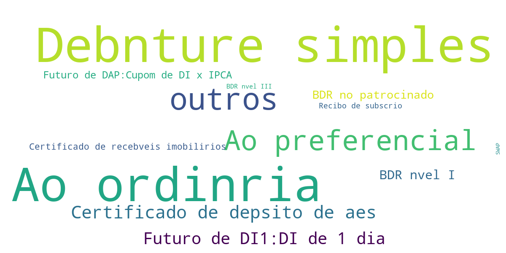
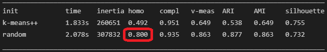
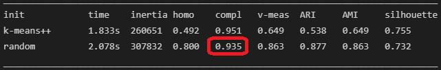
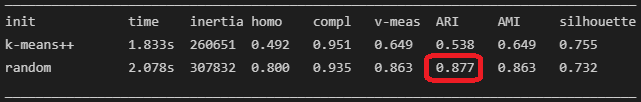
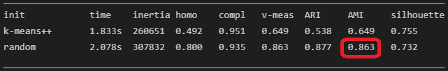

# Projeto: Clusterização Fundos de Ivestimentos
_Documentação de projeto_

## Instruções

Neste documento está disposta a análise dos resultados. O código com as explicações de cada passo estão disponíveis no arquivo [analise.ipynb](analise.ipynb).

É possível visualizar o código e os resultados pelo github. O código foi escrito na versão 3.8.9 do Python.Para executar o código localmente, são necessárias as instalações tanto do Python quanto das bibliotecas: 

- matplotlib.pyplot
- seaborn
- numpy
- pandas
- sklearn
- wordcloud
- time

Além das bibliotecas, é necessário clonar o repositório e não alterar o nome das pastas dentro dele. 

## Objetivo

O projeto Clusterização de Fundos de Investimentos tem por objetivo selescionar características de fundos de investimentod disponibilizados pela CVM no [portal de dados abertos do governo federal](https://dados.gov.br/dataset/fi-doc-cda).

## Dados

Os dados são tabulares, as colunas utilizadas para a clusterização foram: Tipo de Ativo, Tipo de aplicação e Valor de Mercado da posição final. Para avaliar o resultado da clusterização foi utilizado o CNPJ do fundo como classe.

### Análise e limpeza dos dados

- **Separação das colunas**: Diminuição da dimensionalidade dos dados para economizar espaço de memória no processamento
  - As features utilizadas ao longo do projeto foram: "Tipo de Ativo", "Tipo de Aplicação", "Valor de Mercado da Posição Final" e "CNPJ do Fundo"
- **Correlação**: Análise da correlação entre as features. Métrica que ajuda a entender a dependência entre as features e, a partir disso, avaliar se há relação de causalidade entre elas.
  - A análise da correlação foi feita com base nnas features utilizadas para clusterizar, não leva em conta a classe (CNPJ do fundo)
  - No caso do projeto, as features de tipo de ativo e tipo de aplicação apresentaram 94% de correlação. Nesse caso há uma relação de causalidade entre essas duas features dado que um fundo, ao definir os tipos de ativo que irá investir, apresenta tipos de aplicação comcordantes com esses ativos.
    
- **Normalização**: Mudança de escala dos dados.
  - A normalização transmite os mesmos dados de forma balanceada, principalmente quando se trata de modelos de análise baseados em distrância (como a clusterização)
  - Uma feature não normalizada entregue para um algoritmo de clusterização pode ter um peso desbalanceado para aquela medida, desproporcional à real interferência daquela feature para o agrupamento.
- **Tokenização**: Transformação de dados escritos em dados numéricos
  - A análise de todos os resultados deve levar em conta qual o método de tokenização utilizado:

    token = índice da lista dos valores únicos da feature
- **Avaliação do desbalanceamento das features**: A quantidade de tipos de ativos não é proporcional entre os diferentes fundos.
  - A quantidade desproporcional acaba afetando a métrica de correlação porque altera a covariância e o desvio padrão do conjunto. A maior quantidade de fundos de determinados ativos entrega ao Valor de Mercado da Posição Final um peso maior para as amostras dos fundos com tipos de ativo mais comuns. Por coincidência, esses são os tipos de ativo do início da lista gerada para a tokenização e, por isso, a correlação pendeu para o lado negativo entre o valor de mercado da posição final e o tipo de ativo.  
    

## Clusterização

**K-Means**: Apesar de o K-means ser mais indicado para dados contínuos, é ideal para dados com baixa dimensionalidade, ou seja, pequena quantidade de features. 

O algoritmo funciona da seguinte forma:

Há a definição dos centróides, $C_{j}$, que pode ser aleatória ou definida a partir de uma avaliação prévia das amostras (K-Means++)

Após isso, ocorre o cálculo das distâncias entre cada amostra, $X_{i}^{(j)}$ e o centróide. Essa distância pode ser tanto a distância euclidiana como distância de Manhatan.

Somam-se todas as distâncias entre todas as $n$ amostras e os centros de seus clusters, $\sum_{i=1}^{n}$.

Depois somam-se todas as $k$ somas de cada cluster, $\sum_{j=1}^{k}$.

O Objetivo, $J$, do K-Means é obter a menor soma possível. Para uma quantidade de amostras muito maior que a quantidade de clusters, a soma será grande independentemente da qualidade do modelo, por isso a necessidade de outras métricas de avaliação.

### Quantidade de clusters

A quantidade ideal de clusters é a menor possível com a menor variância entre os dados. Isso pode ser avaliado pela "Curva de cotovelo", gráfico que relaciona a soma dos quadrados dentro de um grupo com a quantidade de clusters.

Pelo gráfico, a partir de 4 clusteres, a soma dos quadrados dentro de cada cluster não diminui tão expressivamente, tornando 4 o número ideal de clusteres para o problema

### Clusters

Posicionados no gráfico que relaciona o Tipo de ativo com o Tipo de aplicação, os clusteres receberam labels de 0 a 3 e são destacados com cores de acordo com a legenda no canto superior direito. Os centros estão marcados de preto em cada cluster.

Posicionados no gráfico que relaciona o Tipo de ativo com o o valor de mercado da posição final de cada fundo, os clusteres seguem a legenda de cores do gráfico anterior.

A divisão dos clusters é mais evidenciada pela relação entre as colunas Tipo de Ativo e Tipo de Aplicação. Isso acontece em virtude da maior distribuição dos valores dessas duas colunas. Entretanto, o fato os valores mais elevados de ambas as colunas estarem nos mesmos grupos é explicado pela alta correlação entre elas. Com a correlação mais elevada entre elas, a chance de amostras com valores elevados de Tipo de Ativo e Tipo de Aplicação convergirem para o mesmo grupo é mais elevada.

Os grupos contêm os seguintes tipos de ativo:

Grupo 0

Grupo 1

Grupo 2

Grupo 3

O diagrama de nuvem de palavras indica, por meio do tamanho da fonte das palavras mostradas, a frequência relativa entre cada termo dentro de um grupo. Os valores estão aparecendo sem caracteres especiais pois, na leitura do dataset, esses caracteres foram removidos.

É interessante notar que poucos valores repetiram com frequências semelhantes entre os 4 grupos formados, apenas as Ações preferenciais, Ordinárias e o grupo "outros".

Há dois grupos "outros" no dataset. Aquele que foi inserido pela CVM "Outros" com "O" maiúsculo. e "outros" com "o" minúsculo. Esse segundo foi inserido no dataset para corrigir os valores em branco do dataset sem retirar essas amostras. Esse valor correspondeu à média dos valores numerados durante a clusterização.

A repetição de poucos valores demonstra a boa clusterização dos dados o que é congruente com as métricas a seguir: 

### Métricas

Dois K-means foram avaliados, com inicialização aleatória e com inicialização K-means++, os resultados foram:

**J-Quadrado**

Objetivo do K-means, resultou em 307832 pontos para o modelo com início aleatório e 260651 pontos para o modelo com início utilizando k-means++

**Homogeneidade**

A clusterização satisfaz a homogeneidade em 100% quando todos os clusteres só contêm dados de apenas uma classe. Como estou utilizando como "classe" o CNPJ de cada fundo, para ter uma homogeneidade de 100% seria necessário 23020 clusteres o que geraria um overfit que não responde corretamente o problema dado que a clusterização não se trata de uma classificação, mas sim, do agrupamento de amostras com características semelhantes, mesmo que, de classes diferentes.

A homogeneidade foi, para o K-Means com inicialização aleatória foi de 80% e, para a inicialização com K-Means++ foi de 49,2%

**Silhueta**

A silhueta corresponde a: 

$$
Silhueta = \frac{(Sep-Coes)}{(Sep)}
$$

Essa métrica busca a maior coesão e a maior separação ao mesmo tempo, ou seja o quanto os clusteres estão bem divididos e o quanto seus componentes estão bem agrupados entre si. Quanto mais próximo de -1, menos organizada está a clusterização e será necessário ajustar a quantidade de clusteres para o problema. Quanto mais próximo de 1 mais bem organizados estão os clusteres, mais a observação se encaixa no cluster ao qual foi alocada e mais distante dos outros clusteres ela está.

Para o modelo com início aleatório, a silhueta correspondeu a 73,2% e para o kmeans ++ a silhueta foi de 75,5% indicando a boa organização dos clusters.

**Completude**

Um resultado de clusterização satisfaz a completude se todos os membros de uma determinada classe estão agrupados no mesmo cluster.

Isso indica uma certa coesão entre os elementos da classe. Se uma classe é coesa, por consequência, suas amostras estarão mais próximas entre si e, com isso, há a maior probabilidade de estarem no mesmo cluster.

A completude de 100% indica um modelo em overfitting já que este está altamente ajustado aos valores entregues no momento da construção do modelo e não avaliará bem valores novos no intermédio entre dois clusteres, por exemplo.

Quanto mais próximo de 100% a completude, melhor. O modelo, para inicialização aleatória a completude foi de 94%, para o modelo com inicialização k-means++ foi de 95,1%.

**V-measuring**

Média harmônica entre a completude e a homogeneidade do modelo. É a média que indica o balanceamento entre as duas métricas concorrentes de homogeneidade e completude. Para, dessa forma, identificar se há o balanceamento entre as duas e se o modelo atende bem aos dois parâmetros de qualidade.

O interessante dessa métrica é que ela é independente do valor das labels dos dados entregues ao modelo, dessa forma, nem a mudança nos clusteres nem na classe real do modelo, quando existem, no caso, estou utilizando o CNPJ de cada fundo para avaliar o modelo, altera o valor do V-measure.

O resultado entregue foi de 86% para inicialização aleatória e de 64,9% para inicialização com K-means++ que indicam uma boa relação e equilíbrio entre a completude e homogeneidade do resultado obtido.

**ARI**

Indice de Rand. Calcula a similaridade entre dois grupos.

Quanto mais próximo de 0, mais aleatória é a clusterização, independentemente do número de clusters. Quanto mais próximo de 1, mais semelhantes são os clusteres.

O valor obtido foi de 87,7% de similaridade entre todos os clusteres. Isso pode ser explicado tanto pela baixa quantidade de valores únicos dentro das features, mesmo com a grande quantidade de amostras, mas também porque o modelo como pela boa interpretação do modelo aos dados entregues.

Para identificar qual é a explicação mais coerente para o valor obtido, é interessante avaliar também resutado para o modelo iniciado com K-means++, que é uma inicialização do kmeans de forma estatística em detrimento do modelo aleatório. Seu resultado da similaridade foi de 53,8% o que aponta mais para a melhor interpretação do modelo aos dados. 

**AMI**

Ajuste da informação mútua para levar em conta o acaso da separação dos clusteres, por isso é maior para dois clusteres do que para agrupamentos com número maior de clusteres mesmo que não tenha tantas informações compartilhadas. Quanto mais infotmações compartilhadas, menor a separaçaõ dos clusteres, entretanto, para o presente problema, como existe uma baixa quantidade de classes para muitos dados, as informações compartilhadas são, praticamente, inevitáveis e, por isso, ambos os AMI para inicialização aleatória e kmeans ++ foram altos, mesmo com as demais métricas apontando para o bom ajuste do modelo.

Se o dataset fosse balanceado, existiriam, aproximadamente, 7114 amostras para cada tipo de ativo, por isso o alto índice de informação compartilhada entre os clusteres.

O ajuste da informação foi de 86% para o modelo com inicialização aleatória e de 64,9% para o modelo kmeans++.

## Conclusão

A clusterização apresentou bons resultados tanto com as métricas quanto com a separação observada nas nuvens de palavras.